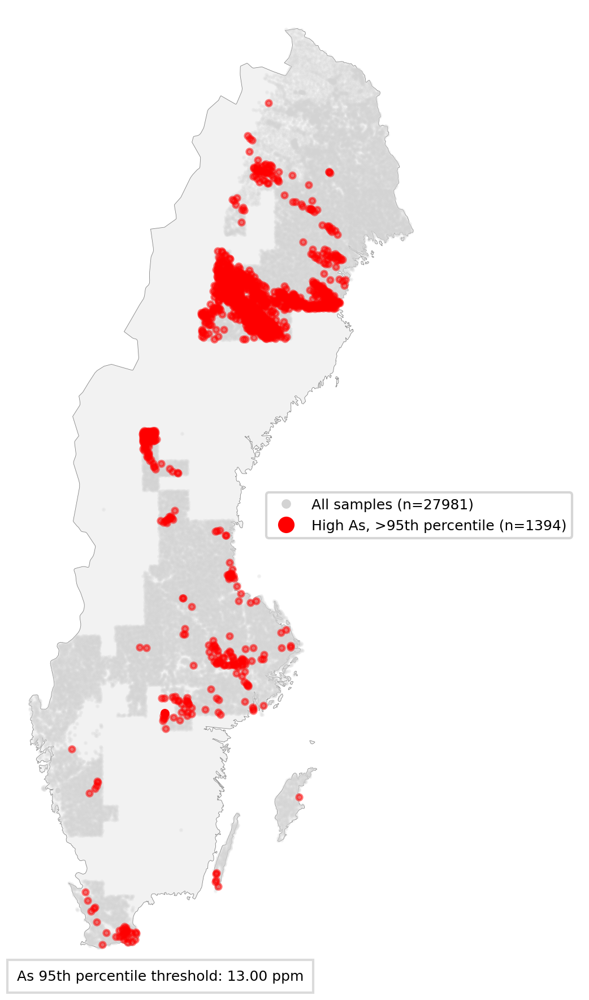
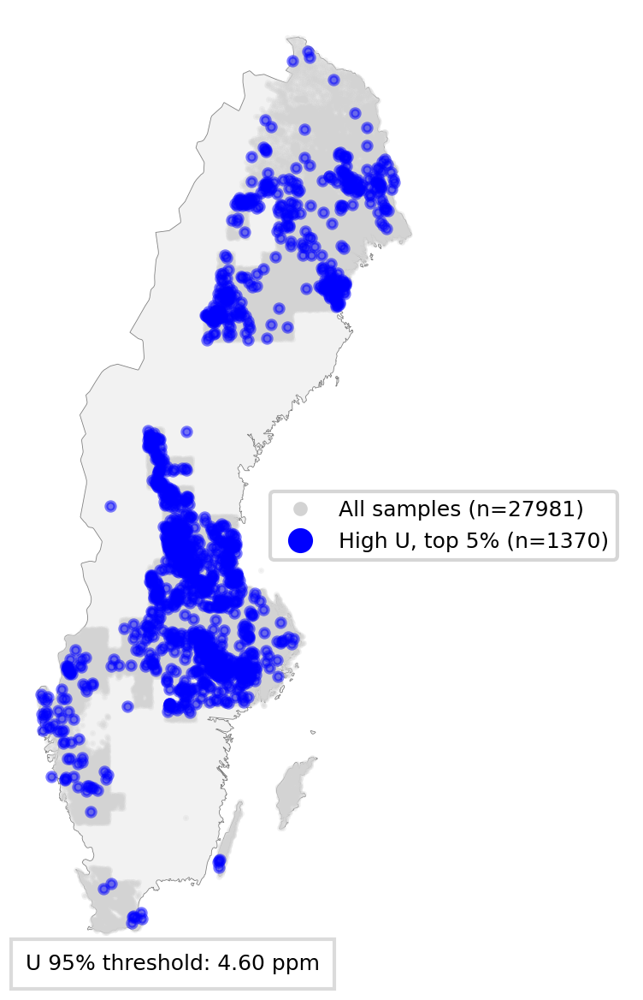
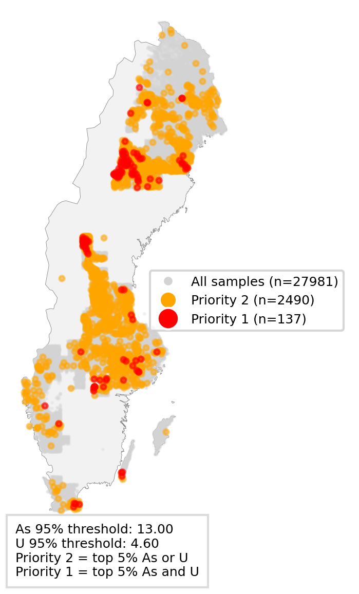

# GeoScreen SE — Arsenic & Uranium Geochemical Screening

**Author:** Marius Tuyishime
**Status:** Pågående, preliminära resultat
**Data source:** SGU Markgeokemi, regional provtagning (layer: `moran_0063mm_hno3_icpms`)

---

## 1. Background / Purpose

Arsenic (As) and uranium (U) occur naturally in bedrock and soils, but elevated concentrations can be environmentally relevant depending on concentration, medium, land use, mobility, and exposure pathways. In early stages of environmental investigations, simple methods are often needed to interpret large geochemical datasets and identify areas where further investigation may be warranted.

This project develops a simple, transparent screening method to identify and prioritize sample points with relatively high As and U concentrations in Swedish till soils, using SGU's regional soil geochemistry data. The goal is **not** a full risk assessment, but a screening-based basis to support early-stage contaminated-site investigations — showing where As and U occur at relatively high levels, and where the two co-occur.

---

## 2. Data & Method

**Data source:**
- Product: Markgeokemi, regional provtagning (SGU)
- Layer: `moran_0063mm_hno3_icpms`
- Medium: Till (moraine), fine fraction <0.063 mm
- Method: HNO₃ leach / ICP-MS
- CRS: SWEREF99 TM (EPSG:3006)

**Cleaning steps:**
1. Dropped rows missing sample ID, coordinates, or geometry.
2. Confirmed CRS as EPSG:3006.
3. Filtered to rows with valid (non-missing), positive values for As, Fe, Ca, Al, and U — excluding SGU's "0 = not analyzed" placeholder and below-detection-limit values (stored as negative numbers).

**Result:** 27,981 analysis-ready sample points (report's original run: ~28,470; the small difference reflects a marginally stricter positive-value filter in this run).

**Percentile-based thresholds:**
- 75th percentile → "elevated" level
- 95th percentile → "high" level / hotspot category

This run's computed thresholds:

| Element | 75th percentile | 95th percentile |
|---|---|---|
| As | 3.90 ppm | 13.00 ppm |
| U | 2.40 ppm | 4.60 ppm |

**Combined prioritization:** Priority 1 = both As and U in top 5%; Priority 2 = either As or U in top 5%; Background = neither.

---

## 3. Results

**Figure 1 — Arsenic screening**
As hotspots (top 5%, red) among all cleaned sample points.

**Arsenic**

**Figure 2 — Uranium screening**
U hotspots (top 5%, blue) among all cleaned sample points.

**Figure 3 — Combined As + U priority**
Priority 1 (red) and Priority 2 (orange) points overlaid on the full sample set.

**Point counts per class:**

| Class | Count | % of total (n=27,981) |
|---|---|---|
| As hotspot (top 5%) | 1,394 | 4.98% |
| U hotspot (top 5%) | 1,370 | 4.90% |
| Priority 1 (both hot) | 137 | 0.49% |
| Priority 2 (either hot) | 2,490 | 8.90% |
| Background | 25,354 | 90.61% |

---

## 4. Interpretation

Results show clear geographic patterns in the highest As and U concentrations, with visible clustering in northern Sweden and parts of central Sweden. Because the method relies on relative percentiles, it identifies points that are high **relative to this dataset**, not necessarily points exceeding regulatory guideline values.

**Priority 1** points are the most notable, since they show co-occurrence of relatively high As and U at the same location — a stronger signal than either element alone. These areas may be worth further investigation, particularly where they coincide with sensitive land use, drinking water interests, or hydrogeological conditions affecting mobility and exposure.

**Priority 2** points indicate that only one of the two elements is relatively elevated. These should not automatically be treated as risk areas but can support further prioritization depending on local context.

**Important:** this is a **screening tool, not a risk map**. It does not incorporate regulatory guideline values, bioavailability, land use, or exposure pathways.

---

## 5. Limitations

- Classification is based on total/leachable concentrations, not bioavailability or chemical speciation.
- Relative percentiles show anomalies **within this dataset**, not regulatory exceedances.
- Local land use, exposure pathways, and receptor information are not included in this version.
- Groundwater conditions, pH, redox environment, and carbonate chemistry are not part of the prioritization model.
- The `> 0` filter excludes both "not analyzed" placeholders (0) and below-detection-limit values (stored as negative numbers) — slightly narrowing the effective dataset compared to a method that treats below-detection values as left-censored data.
- Results should be supplemented with site- and medium-specific information before being used for risk assessment.

---

## 6. Next Steps

To move this analysis from geochemical screening toward more risk-informed prioritization:

1. **Compare against relevant guideline values** — clearly separate relative percentile thresholds from guideline-based assessment.
2. **Add land use or receptor information** — a simple exposure proxy such as residential areas, agricultural land, drinking water interests, or proximity to private wells.
3. **Medium-specific analysis** — keep soil/till, sediment, surface water, and groundwater separate, since risk logic differs by medium.
4. **Geochemical mobility** — use support variables (Fe, Al, Ca, pH) to interpret binding, mobility, and potential transport.
5. **Regional background variation** — test county/regional percentile thresholds instead of a single national threshold, to account for naturally elevated geological background in some areas.
6. **Distribution-aware thresholds** — consider log-transformation before percentile calculation, given the typically right-skewed nature of geochemical concentration data.
7. **Transparent uncertainty reporting** — document data coverage, analytical method, sample medium, spatial resolution, and limitations clearly in any future version.

