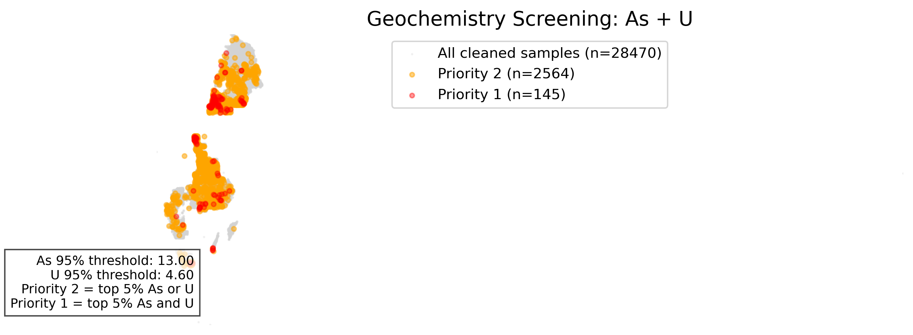
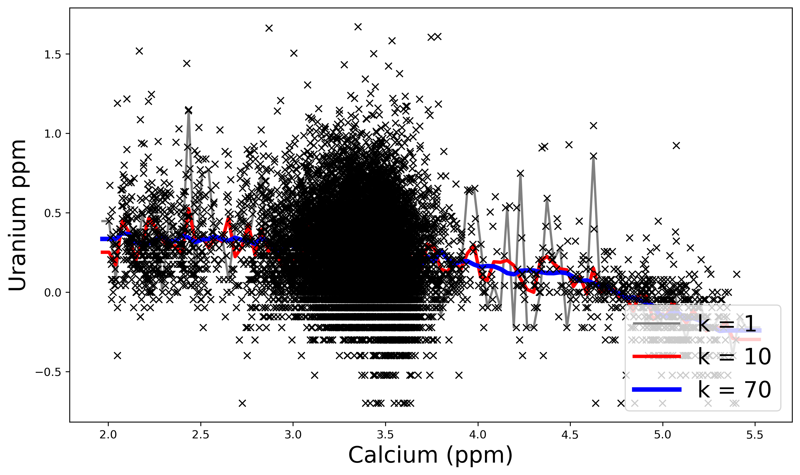
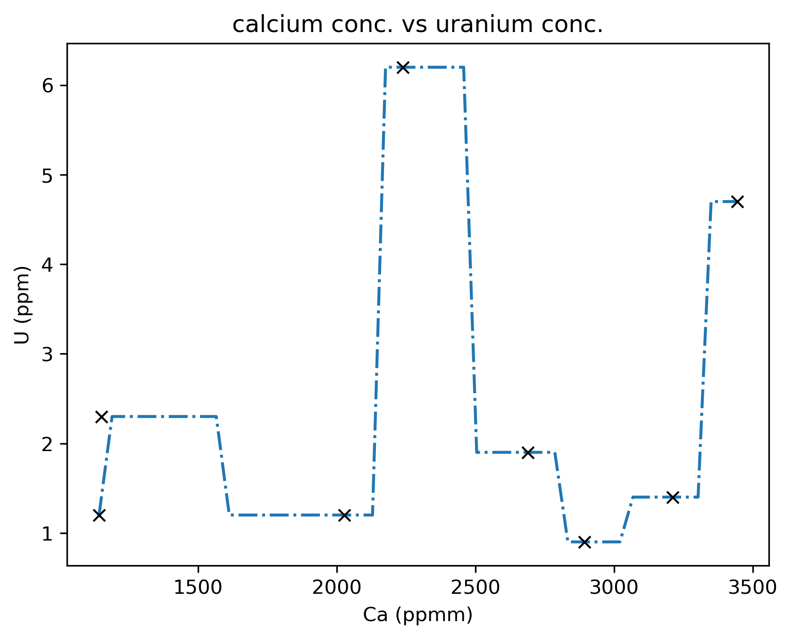

# GeoChem-DataLab
***Modeling Uranium from Calcium***

## Objective
Evaluate whether calcium (Ca) can predict uranium (U) concentrations in regional soil geochemistry using a non-parametric model.

## Data
- Source: SGU regional geochemistry dataset
  Downloaded  [Geochemical atlas of Sweden] (https://www.sgu.se/en/mineral-resources/geokemisk-kartlaggning/geochemical-atlas-of-sweden/data-and-tables/), **Data (CSV-file)**
- Variables:
  - Predictor: Ca (ppm)
  - Target: U (ppm)
- Log10 transformation applied to reduce skewness

## Method
- Model: k-Nearest Neighbors (kNN) regression  
- Train/test split: 60/40 (random_state=42)  
- Tested k range: 1–70  
- Visual comparison for k = 1, 10, 70  

## Results

### Risk map arsenic and uranium

Elevated arsenic (As) and uranium (U) concentrations are spatially clustered rather than uniformly distributed.  
Priority 1 (red) highlights locations where both elements are high, while Priority 2 (orange) indicates areas where one is elevated.  
These clusters represent potential zones for further investigation.
  

- Data show strong clustering and non-linear structure  
- kNN behavior:
  - k = 1 → high variance (overfitting)  
  - k = 10 → moderate smoothing  
  - k = 70 → oversmoothed trend  
- Overall weak predictive relationship between Ca and U

   

 if use k = 1 only 

  

## Interpretation
- Ca alone is insufficient to explain U variability  
- Likely controlled by multiple geochemical processes (e.g., mineralogy, redox, adsorption)  
- kNN captures local patterns but lacks mechanistic insight  

## Limitations
- Single-variable model  
- No spatial context included  
- Detection limits and uncertainty not addressed  

## Next Steps
- Include additional predictors (Fe, Al, As, pH)  
- Add spatial features or geostatistical methods  
- Compare with linear and tree-based models  