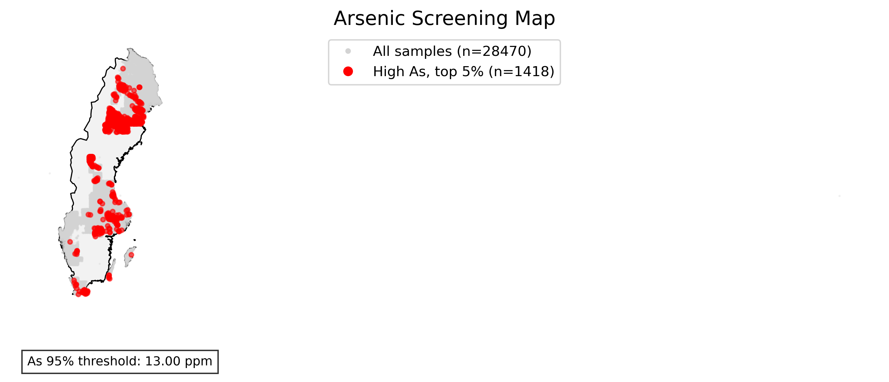
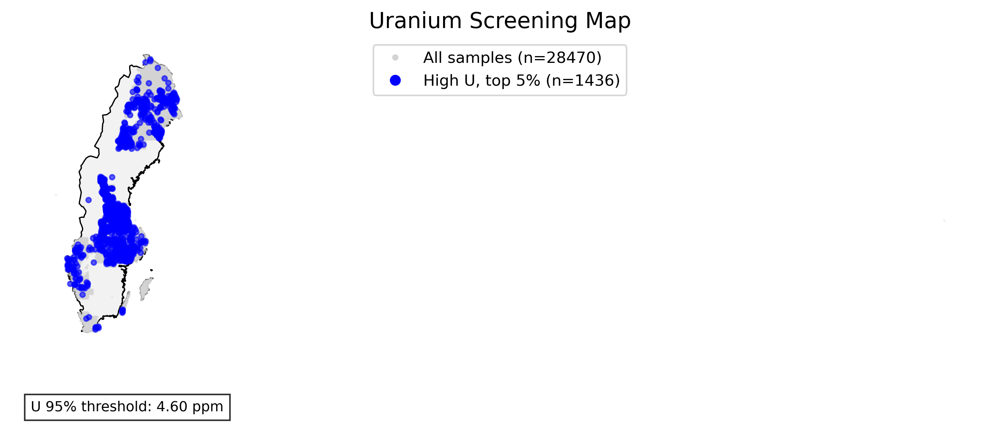

# Prioritering av områden med förhöjda arsenik- och uranhalter 
**Författare:** Marius Tuyishime  
**Status:** Pågående, preliminära resultat  
**Datum:** 2026-04-25

## Sammanfattning

Detta pågående projekt utvecklar en enkel och transparent metod för att identifiera och prioritera områden med förhöjda halter av arsenik (As) och uran (U) i svenska moränjordar. Analysen bygger på SGU:s regionala markgeokemiska data och fokuserar på relativ screening av koncentrationer i datasetet.

Syftet är inte att genomföra en fullständig riskbedömning, utan att ta fram ett screeningbaserat underlag som kan stödja tidiga skeden av miljöutredningar inom förorenade områden. Metoden visar var As och U förekommer i relativt höga halter och var båda ämnena sammanfaller, vilket kan vara relevant för prioritering av vidare undersökning.

De preliminära resultaten visar att de högsta 5 procenten motsvarar cirka **13,00 ppm As** och **4,60 ppm U** i det analyserade datasetet. Baserat på dessa trösklar identifierades **145 provpunkter som Prioritet 1**, där både As och U tillhör de högsta 5 procenten, samt **2 564 provpunkter som Prioritet 2**, där antingen As eller U tillhör de högsta 5 procenten.

## Data
- Source: SGU regional geochemistry dataset
  

Arsenic (As) and uranium (U) concentrations were classified using quantile thresholds.  
Low, medium, and high risk levels were defined using the 75th and 95th percentiles, while hotspots correspond to the top 5% of values.

**Uranium and arsenic combined**
Priority classes were then derived:
- **Priority 1**: both As and U in the top 5%  
- **Priority 2**: either As or U in the top 5%  
- **Background**: remaining samples

This approach provides a relative screening of elevated geochemical concentrations across the dataset.
  

**Arsenic**
 

**Uranium** 
 

## 1. Bakgrund

Arsenik och uran förekommer naturligt i berggrund och jordarter, men förhöjda halter kan vara miljömässigt relevanta beroende på halt, medium, markanvändning, mobilitet och exponeringsvägar. I tidiga skeden av miljöutredningar behövs ofta enkla metoder för att tolka stora geokemiska dataset och identifiera områden där vidare undersökning kan vara motiverad.

SGU:s markgeokemiska data redovisar halter av grundämnen och pH i prover från svensk morän, sediment och ytlig jord. Den regionala markgeokemiska karteringen omfattar bland annat finfraktionen av morän (<0,063 mm) och används för att beskriva regionala geokemiska mönster.

Detta projekt använder dessa data för att utveckla en reproducerbar screeningmetod för As och U med fokus på:

- datarensning och kvalitetssäkring,
- beräkning av relativa tröskelvärden,
- identifiering av förhöjda halter,
- kombinerad prioritering av As och U,
- kartbaserad visualisering av preliminära resultat.

---

## 2. Syfte

Syftet är att utveckla en screeningmetod för att identifiera och prioritera områden med förhöjda halter av arsenik och uran i svenska moränjordar, som stöd för tidiga skeden av miljöutredningar inom förorenade områden.

Projektet ska särskilt visa hur geokemiska data kan omsättas till ett praktiskt beslutsunderlag för vidare undersökning.

---

## 3. Datakälla och omfattning

### 3.1 Datakälla

Analysen baseras på SGU:s regionala markgeokemiska data:

- **Dataprodukt:** Markgeokemi, regional provtagning  
- **Arbetslager:** `moran_0063mm_hno3_icpms`  
- **Medium:** Morän, finfraktion <0,063 mm  
- **Metod:** HNO₃-lakning / ICP-MS  
- **Koordinatsystem:** SWEREF 99 TM, EPSG:3006  

### 3.2 Urval

Följande variabler användes i den preliminära analysen:

- prov-ID,
- koordinater,
- geometri,
- As (ppm),
- U (ppm),
- Fe, Ca och Al (ppm) som potentiella stödvariabler för senare geokemisk tolkning.

Efter rensning och filtrering omfattar analysen cirka **28 470 provpunkter**.

---

## 4. Metod

### 4.1 Databearbetning

Data rensades genom att ta bort poster med saknade prov-ID, koordinater eller geometri. För de element som ingår i analysen behölls endast prover med positiva och icke-saknade värden.

Geodata hanterades i Python med `GeoPandas`, och koordinatsystemet sattes till EPSG:3006 för att säkerställa korrekt geografisk hantering i svensk kontext.

### 4.2 Relativ screening

För As och U beräknades relativa percentiltrösklar:

- **75:e percentilen:** förhöjd nivå,
- **95:e percentilen:** hög nivå,
- **övre 5 procent:** hotspot-kategori.

I denna preliminära version används främst 95:e percentilen för att identifiera de högsta halterna i datasetet.

### 4.3 Ämnesspecifik klassning

För varje ämne klassificerades provpunkterna som:

- **Låg:** ≤ 75:e percentilen,
- **Medel:** > 75:e och ≤ 95:e percentilen,
- **Hög:** > 95:e percentilen.

Observera att dessa klasser beskriver relativa koncentrationsnivåer inom datasetet. De ska inte tolkas som formella riskklasser.

### 4.4 Prioriteringsmodell för As och U

En kombinerad prioriteringsklass togs fram genom att överlagra hotspot-resultaten för As och U.

| Klass | Definition | Tolkning |
|---|---|---|
| Prioritet 1 | Både As och U tillhör de högsta 5 procenten | Samförekomst av relativt höga halter; högst prioritet för vidare kontroll |
| Prioritet 2 | Antingen As eller U tillhör de högsta 5 procenten | En parameter är relativt förhöjd; bör bedömas vidare vid behov |
| Bakgrund | Varken As eller U tillhör de högsta 5 procenten | Ingen relativ hotspot enligt denna metod |

---

## 5. Preliminära resultat

### 5.1 Arsenik

Den beräknade 95:e percentilen för arsenik är cirka **13,00 ppm**. Provpunkter över denna nivå motsvarar de högsta 5 procenten av As-halterna i datasetet.

**Figur 1.** Relativ screening av arsenik. Röda punkter visar provpunkter i de högsta 5 procenten av As-halterna.

### 5.2 Uran

Den beräknade 95:e percentilen för uran är cirka **4,60 ppm**. Provpunkter över denna nivå motsvarar de högsta 5 procenten av U-halterna i datasetet.

**Figur 2.** Relativ screening av uran. Blå punkter visar provpunkter i de högsta 5 procenten av U-halterna.

### 5.3 Kombinerad prioritering av As och U

Den kombinerade prioriteringen visar:

- **Prioritet 1:** 145 provpunkter där både As och U tillhör de högsta 5 procenten.
- **Prioritet 2:** 2 564 provpunkter där antingen As eller U tillhör de högsta 5 procenten.
- **Bakgrund:** övriga provpunkter.

**Figur 3.** Kombinerad screening av As och U. Prioritet 1 visar samförekomst av relativt höga As- och U-halter. Prioritet 2 visar provpunkter där en av parametrarna tillhör de högsta 5 procenten.

---

## 6. Tolkning

Resultaten visar tydliga geografiska mönster i de högsta As- och U-halterna. Eftersom metoden bygger på relativa percentiler identifierar den provpunkter som är höga i förhållande till det aktuella datasetet, inte nödvändigtvis punkter som överskrider regulatoriska riktvärden.

Prioritet 1-punkterna är särskilt intressanta eftersom de visar samförekomst av relativt höga As- och U-halter. Sådana områden kan vara relevanta att undersöka vidare, särskilt om de sammanfaller med känslig markanvändning, dricksvattenintressen eller hydrogeologiska förhållanden som kan påverka mobilitet och exponering.

Prioritet 2-punkterna indikerar att ett av ämnena är relativt förhöjt. Dessa punkter bör inte automatiskt betraktas som riskområden, men de kan fungera som underlag för vidare prioritering beroende på lokal kontext.

---

## 7. Begränsningar

Analysen är preliminär och bör tolkas som en geokemisk screening, inte som en fullständig riskbedömning.

Viktiga begränsningar:

- Klassningen bygger på total- eller lakbara halter, inte på biotillgänglighet eller speciering.
- Relativa percentiler visar anomalier inom datasetet, inte regulatoriska överskridanden.
- Lokal markanvändning, exponering och spridningsvägar ingår inte i nuvarande version.
- Grundvattenförhållanden, pH, redoxmiljö och karbonatkemi ingår inte i prioriteringsmodellen.
- Resultaten behöver kompletteras med plats- och mediumspecifik information innan de används för riskbedömning.

---

## 8. Nästa steg

För att utveckla analysen från geokemisk screening till mer riskinformerad prioritering bör följande steg övervägas:

1. **Jämförelse med relevanta riktvärden**  
   Separera tydligt mellan relativa percentiltrösklar och riktvärdesbaserad bedömning.

2. **Markanvändning eller receptorinformation**  
   Lägg till en enkel exponeringsproxy, exempelvis bostadsområden, jordbruksmark, dricksvattenintressen eller närhet till privata brunnar.

3. **Mediumspecifik analys**  
   Håll isär jord/morän, sediment, ytvatten och grundvatten eftersom risklogiken skiljer sig mellan medier.

4. **Geokemisk mobilitet**  
   Använd stödvariabler såsom Fe, Al, Ca, pH och eventuellt andra geokemiska parametrar för att tolka bindning, mobilitet och potentiell transport.

5. **Tydlig rapportering av osäkerheter**  
   Redovisa datatäckning, analysmetod, provmedium, rumslig upplösning och begränsningar.

---

## 9. Relevans för miljökonsultarbete

Arbetssättet motsvarar tidiga skeden inom arbete med förorenade områden där stora datamängder behöver tolkas och prioriteras inför vidare undersökning. Metoden fokuserar på att omsätta geokemiska data till ett praktiskt beslutsunderlag.

I konsultsammanhang kan ett liknande arbetssätt användas för att:

- identifiera områden som bör granskas närmare,
- stödja planering av kompletterande provtagning,
- kommunicera geokemiska mönster på ett tydligt sätt,
- skilja mellan regionala geokemiska anomalier och områden som kräver mer platsnära riskbedömning.

---

## 10. Slutsats

De preliminära resultaten visar att en enkel percentilbaserad metod kan användas för att identifiera och visualisera områden med relativt förhöjda As- och U-halter i svenska moränjordar. Den kombinerade prioriteringsmodellen ger ett första underlag för att skilja mellan områden där ett ämne är förhöjt och områden där både As och U sammanfaller i de högsta haltnivåerna.

Metoden bör inte beskrivas som en riskkarta i nuvarande form. Den är mer korrekt att beskriva som **geokemisk screening och prioritering av områden för vidare miljöundersökning**. Med tillägg av riktvärden, markanvändning och receptorinformation kan metoden vidareutvecklas till en mer riskinformerad prioriteringsmodell.

---

## Referenser

- Sveriges geologiska undersökning (SGU). **Markgeokemi**. SGU beskriver att Markgeokemi redovisar halter av olika grundämnen och pH-värden i prover från svensk morän, sediment och ytlig jord.  
  https://www.sgu.se/produkter-och-tjanster/geologiska-data/geokemi--geologiska-data/markgeokemi/

- Sveriges geologiska undersökning (SGU). **Kartvisaren Markgeokemi, regional provtagning**. SGU anger att den regionala markgeokemiska karteringen omfattar finfraktionen (<0,063 mm) av morän med en provtäthet på cirka 1 prov per 6–7 km².  
  https://www.sgu.se/produkter-och-tjanster/kartor/kartvisaren/geokemikartvisare/markgeokemi-regional-provtagning/

- Sveriges geologiska undersökning (SGU). **Produkt: Markgeokemi, regional provtagning – beskrivning**. Produkten innehåller information om grundämnen och pH i svensk morän, sediment och ytlig jord, med analysresultat från olika analysmetoder inklusive totalhalter och syralakbara halter.  
  https://resource.sgu.se/dokument/produkter/markgeokemi-regional-provtagning-beskrivning.pdf

