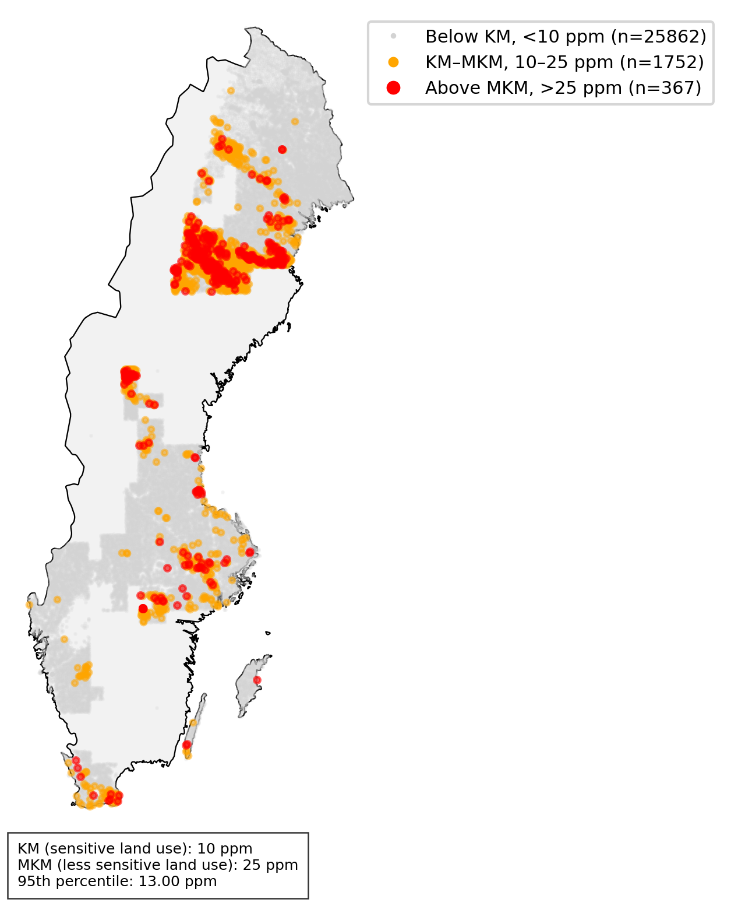

# GeoScreen SE
## ***Arsenic & Uranium Geochemical Screening***

**Author:** Marius Tuyishime
**Status:** Pågående, preliminära resultat
**Data source:** SGU Markgeokemi, regional provtagning (layer: `moran_0063mm_hno3_icpms`)

---

## 1. Background

Arsenic (As) and uranium (U) occur naturally in bedrock and soils, but elevated concentrations can be environmentally relevant depending on concentration, medium, land use, mobility, and exposure pathways. In early stages of environmental investigations, simple methods are often needed to interpret large geochemical datasets and identify areas where further investigation may be warranted.

This mini-project develops a simple screening method to identify and prioritize sample points with relatively high As and U concentrations in Swedish till soils, using SGU's regional soil geochemistry data. Currently, the goal is to develop a simple screening-based basis that can support early stage investigations, such as identifying candidate contaminated areas where As and U occur at relatively elevated levels, and where the two co-occur. This is a foundational first step.
Next, more data will be added, such as sediment, surface soil, pH, land use, and bedrock geology, and the modeling will move forward to spatial interpolation and machine learning, shifting from simply flagging relative highs to actually predicting risk. 
Later stages of the project will narrow the scope to a smaller geographical region, allowing for more detailed, site-specific analysis rather than a broad national screening.

---

## 2. Data & Method

**Data source:**
- Product: [markgeokemi-regional](https://www.sgu.se/produkter-och-tjanster/geologiska-data/geokemi--geologiska-data/markgeokemi/), regional provtagning (SGU)
- Layer: `moran_0063mm_hno3_icpms`
- Medium: Till (moraine), fine fraction <0.063 mm
- Method: HNO₃ leach / ICP-MS
- CRS: SWEREF99 TM (EPSG:3006)

**Cleaning steps:**
1. Dropped rows missing sample ID, coordinates, or geometry.
2. Confirmed CRS as EPSG:3006.
3. Filtered to rows with valid (non-missing), positive values for As, Fe, Ca, Al, and U, excluding SGU's "0 = not analyzed" placeholder and below-detection-limit values (stored as negative numbers, per SGU documentation).

**Output from cleaning:** 27 981 analysis-ready sample points (original Swedish report: 28471 points).

**Percentile-based thresholds:**
- 75th percentile → "elevated" level
- 95th percentile → "high" level / hotspot category

Thecomputed thresholds, concentration in ppm :

| Element | 75th percentile | 95th percentile |
|---|---|---|
| As | 3.90 | 13.00 |
| U | 2.40 | 4.60 |

**Combined prioritization:** Priority 1 = both As and U in top 5%; Priority 2 = either As or U in top 5%; Background = neither.

**Regulatory guideline values (Naturvårdsverket):** for arsenic, generic guideline values for contaminated land are 10 mg/kg TS (KM, for sensitive land use, e.g. homes/schools/gardens) and 25 mg/kg TS (MKM for less sensitive land use, e.g. offices/industry). Notably, the KM value corresponds to the 90th percentile of SGU's regional measurements. The arsenic dataset 95th percentile (13.00 ppm) sits between KM and MKM.

---

## 3. Results

**Figure 1: Arsenic screening**
As hotspots (top 5%, red) among all cleaned sample points.

**Arsenic**

**Figure 2: Uranium screening**
U hotspots (top 5%, blue) among all cleaned sample points.

**Figure 3 — Combined As + U priority**
Priority 1 (red) and Priority 2 (orange) points overlaid on the full sample set.

**Figure 4 — Arsenic vs. Naturvårdsverket guideline values (KM/MKM)**
Points classified against Sweden's legal contaminated-land guideline values rather than relative percentiles.

**Point counts per class (relative percentile screening, n=27,981):**

| Class | Count | % of total (n=27,981) |
|---|---|---|
| As hotspot (top 5%) | 1,394 | 4.98% |
| U hotspot (top 5%) | 1,370 | 4.90% |
| Priority 1 (both hot) | 137 | 0.49% |
| Priority 2 (either hot) | 2,490 | 8.90% |
| Background | 25,354 | 90.61% |

**Point counts per class (Arsenic vs. Naturvårdsverket guideline values, n=27,981):**

| Class | Count | % of total |
|---|---|---|
| Below KM (<10 ppm) | 25,862 | 92.42% |
| KM–MKM (10–25 ppm) | 1,752 | 6.26% |
| Above MKM (>25 ppm) | 367 | 1.31% |

---

## 4. Interpretation

Results show clear geographic patterns in the highest As and U concentrations, with visible clustering in northern Sweden and parts of central Sweden. Because the method relies on relative percentiles, it identifies points that are high **relative to this dataset**, not necessarily points exceeding regulatory guideline values.

**Priority 1** points are the most notable, since they show co-occurrence of relatively high As and U at the same location — a stronger signal than either element alone. These areas may be worth further investigation, particularly where they coincide with sensitive land use, drinking water interests, or hydrogeological conditions affecting mobility and exposure.

**Priority 2** points indicate that only one of the two elements is relatively elevated. These should not automatically be treated as risk areas but can support further prioritization depending on local context.

**Comparison against regulatory guideline values:** notably, 7.6% of sample points (2,119 of 27,981) exceed the Naturvårdsverket KM guideline value of 10 ppm for arsenic — more than the 5% that the relative "top 5%" screening threshold alone would suggest, since KM (10 ppm) is a lower bar than this dataset's own 95th percentile (13.00 ppm). This shows that more of the dataset exceeds the legal "sensitive land use" guideline than the relative screening method alone would indicate — an important finding when moving from relative screening toward regulatory-relevant assessment.

**Important:** this is a **screening tool, not a risk map**. It does not incorporate regulatory guideline values, bioavailability, land use, or exposure pathways.

---

## 5. Limitations

- Classification is based on total/leachable concentrations, not bioavailability or chemical speciation.
- Relative percentiles show anomalies **within this dataset**, not regulatory exceedances.
- No equivalent Naturvårdsverket generic guideline value was identified for uranium in soil; Swedish uranium regulation tends to focus on drinking water and radiological guidance rather than a general soil contamination limit.
- Local land use, exposure pathways, and receptor information are not included in this version.
- Groundwater conditions, pH, redox environment, and carbonate chemistry are not part of the prioritization model.
- The `> 0` filter excludes both "not analyzed" placeholders (0) and below-detection-limit values (stored as negative numbers) — slightly narrowing the effective dataset compared to a method that treats below-detection values as left-censored data.
- Results should be supplemented with site- and medium-specific information before being used for risk assessment.

---

## 6. Next Steps

To move this analysis from geochemical screening toward more risk-informed prioritization:

1. **Compare against relevant guideline values** — done for arsenic in this version (Figure 4); still needed for uranium via an alternative regulatory framework (e.g. drinking water or radiological guidance).
2. **Add land use or receptor information** — a simple exposure proxy such as residential areas, agricultural land, drinking water interests, or proximity to private wells.
3. **Medium-specific analysis** — keep soil/till, sediment, surface water, and groundwater separate, since risk logic differs by medium.
4. **Geochemical mobility** — use support variables (Fe, Al, Ca, pH) to interpret binding, mobility, and potential transport.
5. **Regional background variation** — test county/regional percentile thresholds instead of a single national threshold, to account for naturally elevated geological background in some areas.
6. **Distribution-aware thresholds** — consider log-transformation before percentile calculation, given the typically right-skewed nature of geochemical concentration data.
7. **Transparent uncertainty reporting** — document data coverage, analytical method, sample medium, spatial resolution, and limitations clearly in any future version.

## 7. Way Forward: Toward a Machine Learning-Based Model

The current version of GeoScreen SE is intentionally simple: a transparent, percentile-based screening method that anyone can follow and reproduce without a statistical background. This is a deliberate first step, not a final product.

As the project matures, the plan is to expand both the **data** and the **modeling approach**:

**More data:**
- Incorporate additional SGU layers already present in the delivery (e.g. `moran_2mm_hno3_icpms`, sediment and surface soil tables) to compare As/U behavior across sample media.
- Bring in supporting geochemical variables beyond Fe/Ca/Al already flagged in Section 6 — for example pH, S, and rare earth elements — which may help explain *why* certain points are hotspots, not just *that* they are.
- Add external layers such as bedrock geology, land use, or proximity to drinking water sources, to move from pure geochemistry toward exposure-relevant context.

**Toward machine learning:**
During development, early experiments were done with **k-nearest neighbors (KNN) regression**, testing whether Ca concentration could help predict U concentration at unsampled points. Two versions were tried:
- A manual "by hand" KNN implementation (k=1), to understand the mechanics of nearest-neighbor prediction.
- A `scikit-learn`-based KNN regression sweeping k from 1 to 70, to observe the classic bias-variance tradeoff (low k = overfit/noisy, high k = oversmoothed).

These experiments were **exploratory and kept separate from the current screening pipeline** — they answer a different question (can one variable predict another?) than the percentile method (which points are relatively elevated?). They are, however, a useful proof of concept for where this project is heading:

- **Spatial interpolation** (e.g. kriging, IDW, or KNN-based prediction) to move from discrete sample points toward continuous surfaces — directly addressing the "points vs. areas" limitation noted by early reviewers of this report.
- **Regression/classification models** using Fe, Ca, Al, pH, and other geochemical variables as predictors, to model *mobility and likely bioavailability* rather than relying on raw concentration alone.
- **Train/test validation** (as already practiced in the KNN experiments) to properly evaluate any future predictive model, rather than relying solely on descriptive percentile statistics.
- Eventually, a **risk-informed prioritization model** that combines geochemical prediction, land use, and exposure pathways — the natural endpoint hinted at in Section 6.

The percentile screening method in this report remains the **baseline and reference point**: any future ML-based model should be validated against it, and should improve on — not obscure — its transparency and reproducibility.