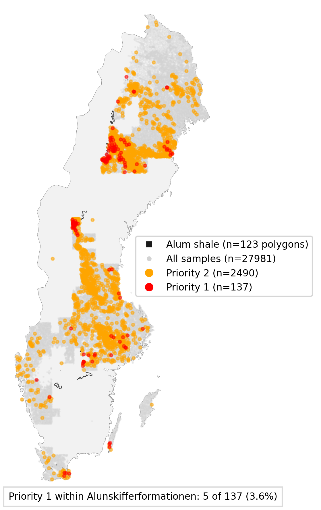

# GeoScreen- Arsenic and Uranium Geochemical Screening

**Author:** Marius Tuyishime. **Data:** SGU Markgeokemi. **Status:** pågående.

---

## 1. Background

Arsenic (As) and uranium (U) occur naturally in bedrock and soils. Elevated concentrations can be environmentally relevant, depending on concentration, medium, land use, mobility, and exposure pathways.

This mini-project builds a simple screening method to identify sample points with relatively high As and U concentrations in Swedish till soils, using SGU's regional soil geochemistry data. Candidate areas are identified for further investigation, especially where As and U are both elevated at the same point. This is a first step.

Beyon this initial step, future development will add more input data, e.g., sediment, surface soil, pH, land use, and bedrock geology. The project will then move toward spatial interpolation and machine learning. The project will then move toward spatial interpolation and machine learning. The aim is to move from identifying relative geochemical highs to predicting areas of potential risk. Later stages will focus on more detailed, site-specific analysis.

## 2. Data and Method

**Data source:**

- Product: [markgeokemi-regional](https://www.sgu.se/produkter-och-tjanster/geologiska-data/geokemi--geologiska-data/markgeokemi/), regional provtagning (SGU); layer: `moran_0063mm_hno3_icpms`
- Material: Till (moraine), fine fraction <0.063 mm
- Method: HNO$_3$ leaching / ICP-MS
- CRS: SWEREF99 TM (EPSG:3006)

**Cleaning steps:**

1. Dropped rows missing sample ID, coordinates, or geometry.
2. Confirmed CRS as EPSG:3006.
3. Filtered to rows with valid, positive values for As, Fe, Ca, Al, and U. Excluded SGU's "0 = not analyzed" placeholder and below-detection-limit values (stored as negative numbers, per SGU documentation).

**Output** 

**27 981** analysis-ready sample points (original dataset: 28 471 points). The computed percentile-based thresholds: 75th percentile (P75) → **elevated** and 95th percentile (P95) → **high or hotspots**.

| Element | P75 | P95 |
|---|---:|---:|
| As | 3.90 | 13.00 |
| U | 2.40 | 4.60 |

**Table 1.** Percentile-based thresholds for arsenic (As) and uranium (U).

**Regulatory guideline values (Naturvårdsverket):** for As, generic guideline values for contaminated land are 10 mg/kg TS (KM, sensitive land use, e.g. homes, schools, and gardens) and 25 mg/kg TS (MKM, less sensitive land use, e.g. offices and industry). The computed 90 percentile  for As (8.4 ppm) of the SGU's regional data falls slightly below the KM value but the P95 (13.00 ppm) sits between KM and MKM.

**Supplementary geological layer, alum shale (Alunskiffer):**

**Product:** [Berggrund 1:50 000–1:250 000](https://www.sgu.se/produkter-och-tjanster/geologiska-data/berggrund--geologiska-data/berggrund/) (SGU bedrock geology). The GeoPackage was downloaded from SGU: [berggrund50k-250k.zip](https://resource.sgu.se/data/oppnadata/berggrund50k-250k/berggrund50k-250k.zip). Alum shale polygons (n = 123) were extracted, reprojected to EPSG:3006, and overlaid with the Priority 1 and Priority 2 results (see Figure 5).

## 3. Results

As hotspots (top 5%, red) among all cleaned sample points (Fig. 1).

U hotspots (top 5%, blue) among all cleaned sample points (Fig. 2).

Priority 1 (red) and Priority 2 (orange) points overlaid on the full sample set (Fig. 3).

Points classified against Sweden's legal contaminated-land guideline values (Naturvårdsverket) (Fig .4).

Priority 1 and Priority 2 points, with mapped alum shale bedrock polygons (black, n=123) (Fig .5).

 

**Point counts per class (relative percentile screening, n=27 981):**

| Class | Count | % of total |
|---|---:|---:|
| As hotspot (top 5%) | 1 394 | 4.98% |
| U hotspot (top 5%) | 1 370 | 4.90% |
| Priority 1 (both hotspots) | 137 | 0.49% |
| Priority 2 (either hotspots) | 2 490 | 8.90% |
| Background | 25 354 | 90.61% |

**Table 2**: Point counts per class (relative percentile screening, n=27 981)

| Class | Count | % of total |
|---|---:|---:|
| Below KM (<10 ppm) | 25 862 | 92.42% |
| KM-MKM (10-25 ppm) | 1 752 | 6.26% |
| Above MKM (>25 ppm) | 367 | 1.31% |

**Table 3**: Point counts per class (As vs. Naturvårdsverket guideline values, n=27 981)

## 4. Interpretation

The screening shows clear geographic clustering of high As and U values, mainly in northern and parts of central Sweden (Fig. 1 & 2). This method identifies points that are high relative to this dataset (Table 2). It does not confirm regulatory exceedance on its own.

Priority 1 points (both As and U high) are the strongest signal, since two independent measurements agree (Fig. 3). Priority 2 points (only one element high) are weaker and need more context before being treated as risk areas.

**Guideline comparison:** 7.6% of points (2,119 of 27,981) exceed the Naturvårdsverket KM guideline value (10 ppm As) (Table 3). This is more than the 5% implied by the relative screening threshold, because KM sits below this dataset's own 95th percentile (13.00 ppm). Guideline-based screening identifies more points than percentile-based screening.

**Alum shale overlay (Figure 5):** Priority 1 points in northern and central Sweden appear near mapped alum shale polygons on the map. Alum Shale is known to contain elevated uranium and trace metals (Lecomte et al., 2017), who also described that in northern Sweden, stronger Caledonian metamorphism resulted in redistribution of uranium into new U-bearing mineral phases. This gives a plausible geological reason for a north-south difference, but it has not been tested against this dataset.

This spatial pattern is a hypothesis, not a confirmed finding. Only 5 of 137 Priority 1 points (3.6%) fall inside a mapped shale polygon. This number alone does not confirm or rule out a real association, since no distance-based test or random baseline has been run. Section 6 lists this as a planned next step.

Southern clusters (Skåne, Gotland) show little nearby shale in this dataset. The cause of this pattern cannot be determined from the current analysis. Investigating the relationship between Priority 1 clusters and alum shale, is therefore identified as a topic for future analysis. Moreover, this is a screening tool, not a risk map. It does not account for bioavailability, land use, or exposure pathways.

## 5. Limitations

- Classification is based on total/leachable concentrations, not bioavailability or chemical speciation.
- Relative percentiles show anomalies within this dataset, not regulatory exceedances.
- No Naturvårdsverket generic guideline value exists for uranium to assess contaminated in soil as it is for arsenic.
- Local land use, exposure pathways, and receptor information are not included in this version.
- Groundwater conditions, pH, redox environment, and carbonate chemistry are not part of the model.
- The alum shale overlay is untested. It does not account for glacial transport distance, ice-flow direction, or shale occurrences missing from this dataset.

## 6. Next Steps

1. Test the relationship between Priority 1 points and alum shale using nearest-distance analysis and an appropriate statistical comparison.
2. Assess spatial clustering of As and U hotspots while considering sampling density.
3. Add relevant geological and geochemical variables, including Fe, Al, Ca, pH, and bedrock geology, to investigate patterns in elevated As and U.
4. Compare additional SGU sample media where appropriate, while keeping till, sediment, and surface soil separate.
5. Explore simple spatial prediction methods such as KNN, using spatially appropriate validation.
6. Document data coverage, analytical methods, detection limits, and processing steps to ensure reproducibility.

## 7. Future Development

The current method is a percentile-based screening approach for identifying relative As and U anomalies. It does not predict concentrations or environmental risk.

Future work will focus on combining the geochemical results with geological, spatial, and additional environmental data. Simple predictive methods, including KNN regression, may be tested as an exploratory step to evaluate whether additional variables improve prediction of As or U concentrations.

If useful, later versions can develop spatial interpolation and predictive models using geological and geochemical variables. Any risk-oriented screening would require additional information on land use, exposure pathways, and site-specific conditions.

## 8. References

- Lecomte, A., Cathelineau, M., Michels, R., Peiffert, C., Brouand, M. (2017). *Uranium mineralization in the Alum Shale Formation (Sweden).* **Ore Geology Reviews, 88**, 71–98.
- Naturvårdsverket. *Riktvärden för förorenad mark.*
- SGU. *Markgeokemi, regional provtagning.*